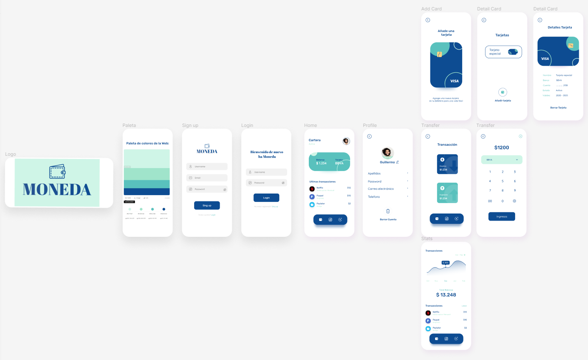
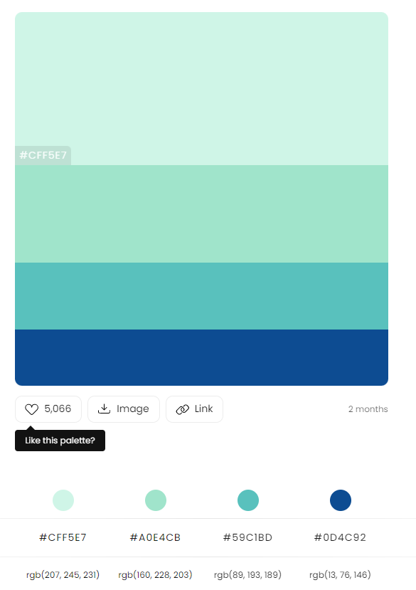

# DIW_Proyecto_IONIC
> Proyecto individual de Angular. Cartera online sencilla e intuitiva, puedes crear tu cuenta, añadirte tus trajetas y empezar ha relaizar transaciones.
## Figma 📄
1. Boceto realizado en figma 
    * 
[Visita mi boceto figma](https://www.figma.com/file/5d6nkFyVA8etj36ndaUTuR/Cartera-Online?node-id=0%3A1&t=rvMTKw1nBbeoyJWc-1)
## Programas necesarios 🔧
1. Se necesitara `npm` para iniciar el proyecto
    * Primero vamos a la carpeta donde esta el proyecto `cd proyecto`
    * Una vez dentro lanzamos `npm install` y se instalara todo 
2. Para lanzar el servidor y poder ver la aplicacion lanzamos `ionic serve` o `ionic serve -l` para verlo en formato movil
## Estilos 🎨 
1. Fuentes
    * *Rubik*
    *  *Quicksand*
2. Paleta de colores 
    *   
## Construido con 🛠️
* TypeScript
* SCSS
* HTML
* JavaScript
## Autor ✒️
### **Guillermo Lorca**